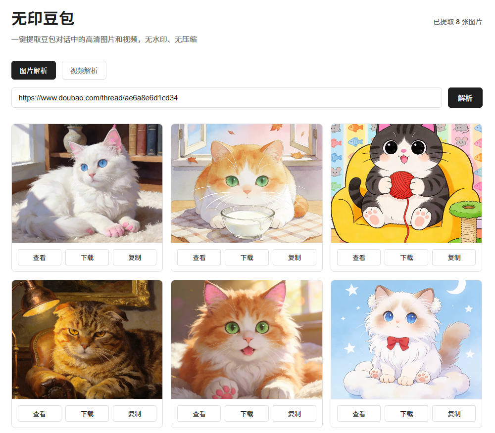
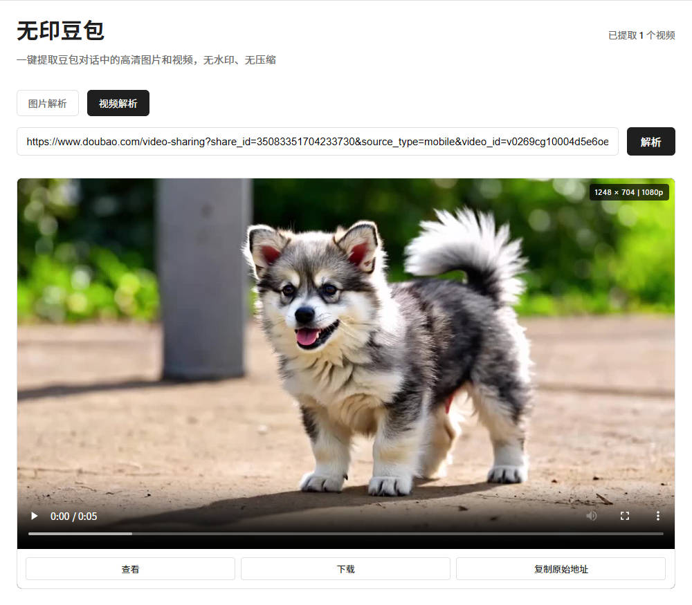
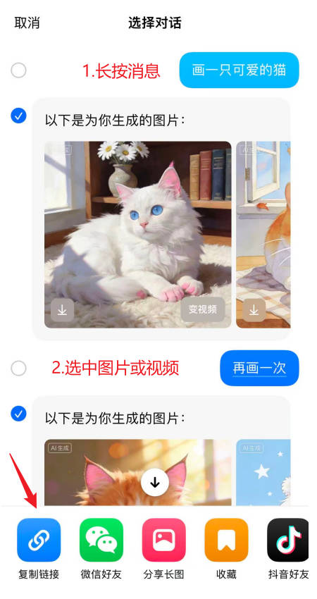
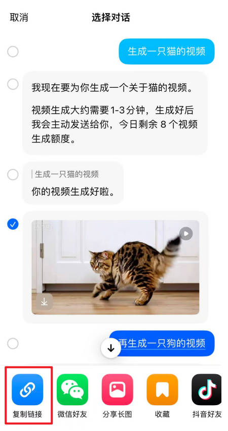

# 无印豆包

从豆包对话链接中提取无水印图片和视频资源的 API 服务


## 快速开始

### 方式一：本地运行（推荐使用 uv）

```bash
# 1. 克隆项目
git clone https://github.com/ihmily/doubao-nomark.git
cd doubao-nomark

# 2.使用 uv 创建虚拟环境并安装依赖
uv sync

# 3. 激活虚拟环境
source .venv/bin/activate  # Linux/Mac
# 或 
Set-ExecutionPolicy -ExecutionPolicy RemoteSigned -Scope CurrentUser
.venv\Scripts\Activate.ps1  # Windows PowerShel

# 4. 运行服务
uvicorn app:app --host 0.0.0.0 --port 8000
```

### 方式二：使用 pip

```bash
# 1. 安装依赖
pip install -r requirements.txt

# 2. 运行服务
uvicorn app:app --host 0.0.0.0 --port 8000
```

### 方式三：Docker 部署

**方式 A：使用远程镜像**

```bash
# 拉取镜像
docker pull ihmily/doubao-nomark

# 运行容器
docker run -d -p 8000:8000 --name doubao-app ihmily/doubao-nomark

# 查看日志
docker logs -f doubao-app

# 停止容器
docker stop doubao-app

# 删除容器
docker rm doubao-app
```

**方式 B：本地构建镜像**

```bash
# 构建镜像
docker build -t doubao-nomark .

# 运行容器
docker run -d -p 8000:8000 --name doubao-app doubao-nomark
```

### 方式四：作为 Python 库使用

如果你需要在自己的 Python 项目中集成调用，可以将本项目作为库安装：

#### 安装

```bash
# 克隆项目
git clone https://github.com/ihmily/doubao-nomark.git
cd doubao-nomark

# 以可编辑模式安装
pip install -e .
```

#### 调用示例

**解析图片：**

```python
from doubao_parser.image import doubao_image_parse

# 异步调用
result = await doubao_image_parse(
    url="https://www.doubao.com/thread/xxxxxx",
    return_raw=False  # False: 返回简化格式, True: 返回原始数据
)
```

**解析视频：**

```python
from doubao_parser.video import doubao_video_parse

# 异步调用
video_data = await doubao_video_parse(
    url="https://www.doubao.com/video-sharing?share_id=xxx&video_id=xxx",
    return_raw=False
)
```

具体代码参考doubao_parser目录下代码。

## 界面演示





## 使用说明

### 获取分享链接方法

|  |  |
| :-----------------------------------------------------: | :-----------------------------------------------------: |


### 访问 API 文档

访问 `http://localhost:8000/docs` 查看交互式 API 文档

### 提取图片

**POST** `/parse`

```json
{
  "url": "https://www.doubao.com/thread/xxxxxx",
  "return_raw": false
}
```

**GET** `/parse?url=https://www.doubao.com/thread/xxxxxx`

**响应示例：**

```json
{
  "success": true,
  "image_count": 3,
  "images": [
    {
      "url": "https://...",
      "width": 1024,
      "height": 768
    }
  ]
}
```

### 提取视频

**POST** `/parse-video`

```json
{
  "url": "https://www.doubao.com/video-sharing?share_id=xxx&video_id=xxx",
  "return_raw": false
}
```

**GET** `/parse-video?url=https://www.doubao.com/video-sharing?share_id=xxx&video_id=xxx`

**响应示例：**

```json
{
  "success": true,
  "video": {
    "url": "https://...",
    "width": 1920,
    "height": 1080,
    "definition": "1080p",
    "poster_url": "https://..."
  }
}
```


## 📝 许可证

本项目仅供学习交流使用

---

**注意**：使用本服务时请遵守豆包平台的使用条款和相关法律法规
