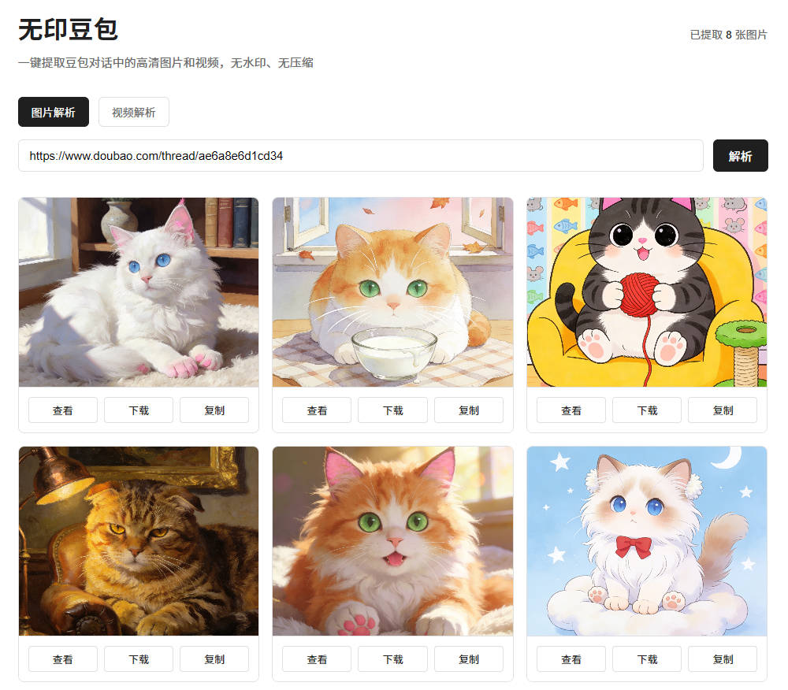
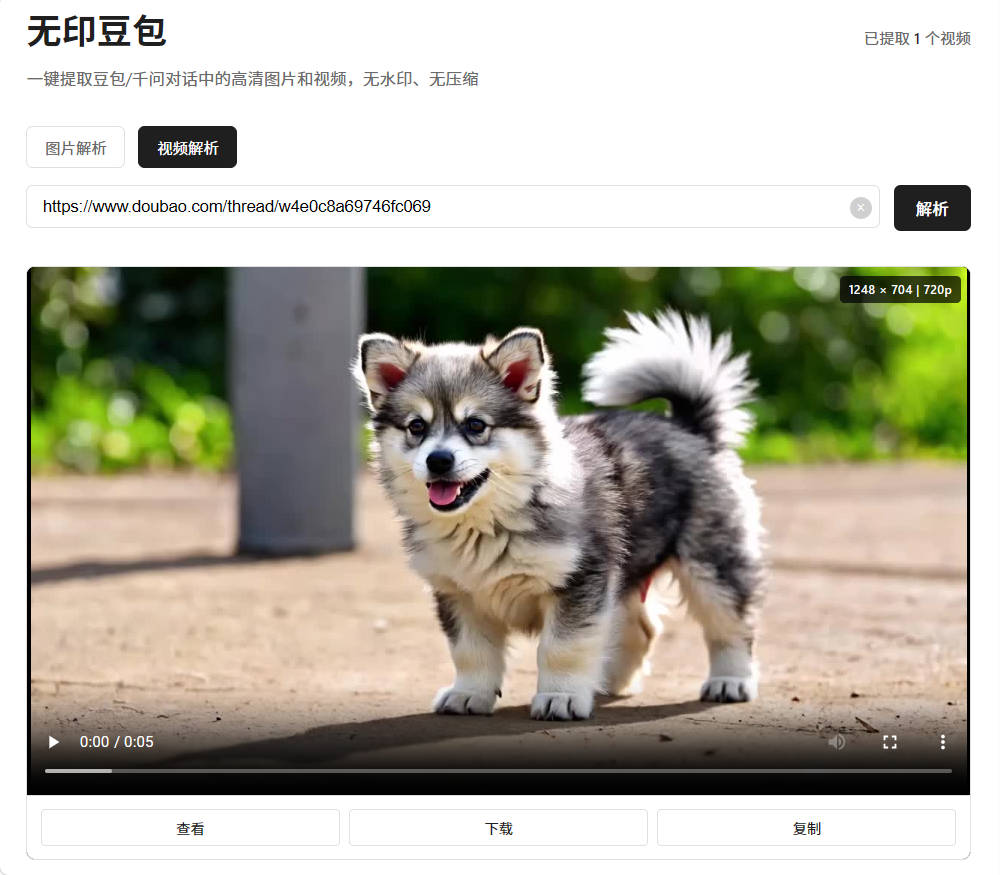
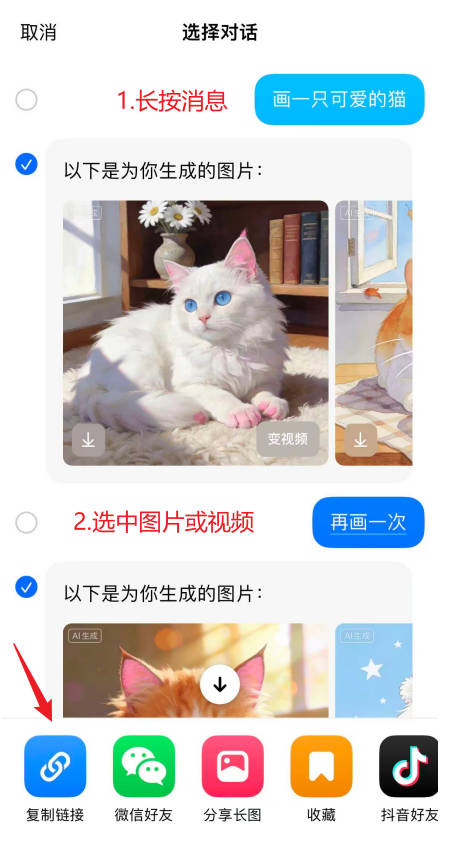
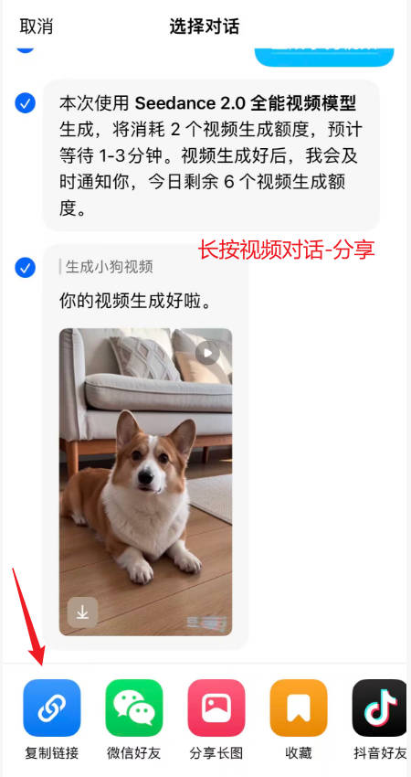
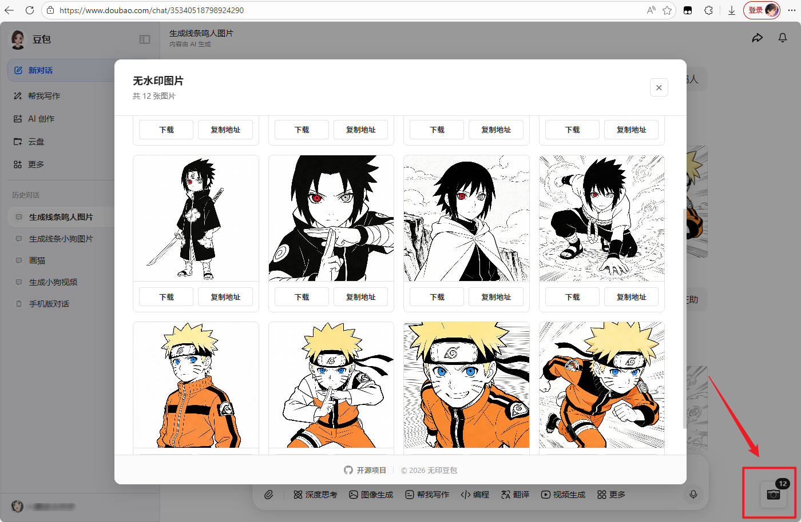

<div align="center">
  
  <h1>无印豆包</h1>
</div>
<p align="center">
  <a href="https://github.com/ihmily/doubao-nomark/stargazers"></a>
  <a href="https://www.python.org/downloads/"></a>
  <a href="https://hub.docker.com/r/ihmily/doubao-nomark/tags"></a>
  <a href="https://opensource.org/licenses/MIT"></a>
</p>


<p align="center">从豆包对话链接中提取无水印图片和视频资源的 API 服务/浏览器插件</p>

## 更新日志

- **v1.0.5**：修复豆包无水印视频提取、浏览器插件新增支持视频无水印提取
- **v1.0.4**：API和插件新增支持千问（Qianwen.com）聊天页图片提取功能

## 快速开始

### 方式一：本地运行（推荐使用 uv）

```bash
# 1. 克隆项目
git clone https://github.com/ihmily/doubao-nomark.git
cd doubao-nomark

# 2.使用 uv 创建虚拟环境并安装依赖
uv sync

# 3. 激活虚拟环境
source .venv/bin/activate  # Linux/Mac
# 或 
Set-ExecutionPolicy -ExecutionPolicy RemoteSigned -Scope CurrentUser
.venv\Scripts\Activate.ps1  # Windows PowerShel

# 4. 运行服务
uvicorn app:app --host 0.0.0.0 --port 8000
```

### 方式二：使用 pip

```bash
# 1. 安装依赖
pip install -r requirements.txt

# 2. 运行服务
uvicorn app:app --host 0.0.0.0 --port 8000
```

### 方式三：Docker 部署

**方式 A：使用远程镜像**

```bash
# 拉取镜像
docker pull ihmily/doubao-nomark

# 运行容器
docker run -d -p 8000:8000 --name doubao-app ihmily/doubao-nomark

# 查看日志
docker logs -f doubao-app

# 停止容器
docker stop doubao-app

# 删除容器
docker rm doubao-app
```

**方式 B：本地构建镜像**

```bash
# 构建镜像
docker build -t doubao-nomark .

# 运行容器
docker run -d -p 8000:8000 --name doubao-app doubao-nomark
```

### 方式四：作为 Python 库使用

如果你需要在自己的 Python 项目中集成调用，可以将本项目作为库安装：

#### 安装

```bash
# 克隆项目
git clone https://github.com/ihmily/doubao-nomark.git
cd doubao-nomark

# 以可编辑模式安装
pip install -e .
```

#### 调用示例

**解析图片：**

```python
from doubao_parser.image import doubao_image_parse

# 异步调用
result = await doubao_image_parse(
    url="https://www.doubao.com/thread/xxxxxx",
    return_raw=False  # False: 返回简化格式, True: 返回原始数据
)
```

**解析视频：**

```python
from doubao_parser.video import doubao_video_parse

# 异步调用
video_data = await doubao_video_parse(
    url="https://www.doubao.com/thread/xxxxxx",
    return_raw=False
)
```

具体代码参考doubao_parser目录下代码。

## 界面演示





## 使用说明

### 获取分享链接方法

|  |  |
| :-----------------------------------------------------: | :---------------------------------------------------------: |
|                    获取图片分享链接                     |                      获取视频分享链接                       |

**目前获取视频分享链接的方式与图片已经一致。** 长按对话选中对应图片或者视频，然后点击分享复制链接地址。

### 访问 API 文档

访问 `http://localhost:8000/docs` 查看交互式 API 文档

### 提取图片

**POST** `/parse`

```json
{
  "url": "https://www.doubao.com/thread/xxxxxx",
  "return_raw": false
}
```

**GET** `/parse?url=https://www.doubao.com/thread/xxxxxx`

**响应示例：**

```json
{
  "success": true,
  "image_count": 3,
  "images": [
    {
      "url": "https://...",
      "width": 1024,
      "height": 768
    }
  ]
}
```

### 提取视频

**POST** `/parse-video`

```json
{
  "url": "https://www.doubao.com/thread/xxxxxx",
  "return_raw": false
}
```

**GET** `/parse-video?url=https://www.doubao.com/thread/xxxxxx`

**响应示例：**

```json
{
  "success": true,
  "video": {
    "url": "https://...",
    "width": 1920,
    "height": 1080,
    "definition": "1080p",
    "poster_url": "https://..."
  }
}
```

## 浏览器扩展

为了更方便地使用（无需服务端），本项目提供了多种浏览器扩展方案：

### 油猴脚本

**快速安装：** 直接访问 [Greasy Fork](https://greasyfork.org/zh-CN/scripts/561907-%E6%97%A0%E5%8D%B0%E8%B1%86%E5%8C%85-%E5%9B%BE%E7%89%87%E6%8F%90%E5%8F%96) 安装

**使用步骤：**
1. 确保已安装 [Tampermonkey](https://www.tampermonkey.net/) 或其他油猴脚本管理器
2. 点击上方链接一键安装脚本

### Edge 扩展

**在线安装：**

1. 访问Edge扩展安装页面：[无印豆包 - 素材提取](https://microsoftedge.microsoft.com/addons/detail/hjlplfcnpgglfdjafekcgahffdengaij)
2. 点击「获取」按钮即可完成安装

**使用说明：**

- 在豆包聊天界面会在页面右下角显示📷按钮，点击按钮可以打开素材下载面板
- 在豆包对话页面会自动识别并提取无水印的图片和视频资源

### 插件演示



## Star History

[](https://www.star-history.com/#ihmily/doubao-nomark&type=date&legend=top-left)

## 许可证

本项目仅供学习交流使用

---

**注意**：使用本服务时请遵守豆包平台的使用条款和相关法律法规
